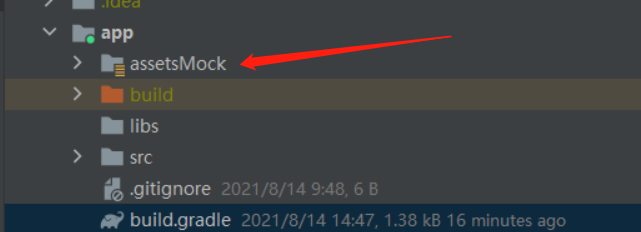

[](https://jitpack.io/#KingSwim404/KingSwimMock)

# KingSwimMock:

一个简易的本地模拟网络JSON数据的小工具。

备注：感谢大佬[柯基](https://github.com/Blankj),工具类的帮助。

## 使用说明：

### 1、将`jitpack`添加到项目的`build.gradle`文件中，如下：

```java
allprojects {
    repositories {
        maven { url "https://jitpack.io" }
    }
}
```
### 2、依赖的其他库:

```java

dependencies {
    implementation 'com.google.code.gson:gson:2.8.6'
    implementation 'com.squareup.okhttp3:okhttp:4.9.0'
    implementation 'com.github.KingSwim404:KingSwimMock:1.0.0'          
 }
```

### 3、代码使用：

```
//最好在Application 初始化以下配置。
//只有debug的时候才使用模拟数据  
MockHelper.setMockMode(BuildConfig.DEBUG)
//初始化数据:以下2个方法只能调用其中一个。
MockHelper.init(this,"文件名") //针对单个文件：会去读取 assets 目录中的指定的json文件。
//MockHelper.init(this,"文件夹名",true) //针对多个文件：会去读取 assets 目录中的指定目录下的所有子json文件。


//配置模拟数据拦截器
val client = OkHttpClient().newBuilder().apply {
                //只有debug模式下才添加Mock数据拦截器
                if(BuildConfig.DEBUG){
                    addInterceptor(HttpMockInterceptor())
                }
            }.build()
            
```

### 4、准备模拟数据：

在assets目录下建立对应的JSON文件【xxx.json】

1. 模拟某个接口【baseURL/v3/king】

   ```json
   // key为请求路径，不一定要全路径;value为模拟的JSON数据。
   // 只要保证2点即可：
   // 1、唯一;
   // 2、key属于路径的一部分即可  
   {
     "v3/king":{
       "msg": "xxx",
       "code": "400",
       "data": {
         "msg": "模拟数据~~~king"
       }
     }
   }
   ```

2. 模拟多个接口【baseURL/v3/king】【baseURL/v3/swim】：

   ```json
   {
     "v3/king":{
       "msg": "xxx",
       "code": "400",
       "data": {
         "msg": "模拟数据~~~king"
       }
     },
     "v3/swim":{
       "msg": "xxx",
       "code": "400",
       "data": {
         "msg": "模拟数据~~~swim"
       }
     }
   }
   ```

3. 多个接口数据格式一样：key之间用 “ ; ” 分隔。这样就不用写2套一样的数据

   ```json
   {
     "v3/king0;v3/king1":{
       "msg": "xxx",
       "code": "400",
       "data": {
         "msg": "模拟数据~~~KingSwim"
       }
     }
   }
   ```

4. 某个接口不想使用模拟数据了，添加一个字段即可【"mock": false】。

   ```json
   //再次使用模拟数据：mock置为true 或者 删除该字段。
   {
     "v3/king":{
       "mock": false,
       "msg": "xxx",
       "code": "400",
       "data": {
         "msg": "模拟数据~~~king"
       }
     }
   }
   
   ```

### 5、其他建议配置（非必须）

在app目录下建立文件夹【assetsMock】并在【app/build.gradle】中配置，不要直接使用asset目录。这样模拟数据就不会被打包进Release App,另外也便于统一管理。

```
sourceSets{
       debug {
            assets.srcDirs = ['assetsMock']
       }
  }
```

 

